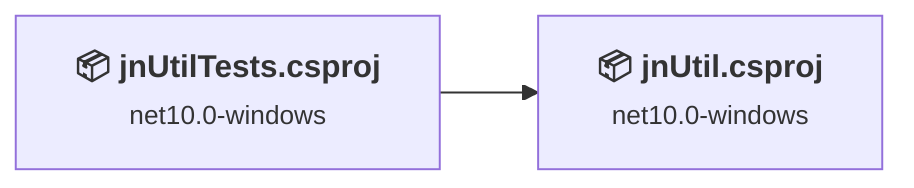
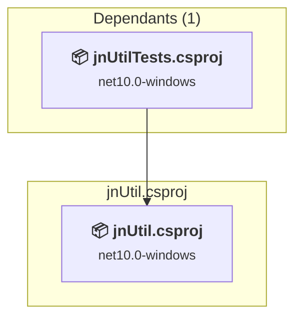
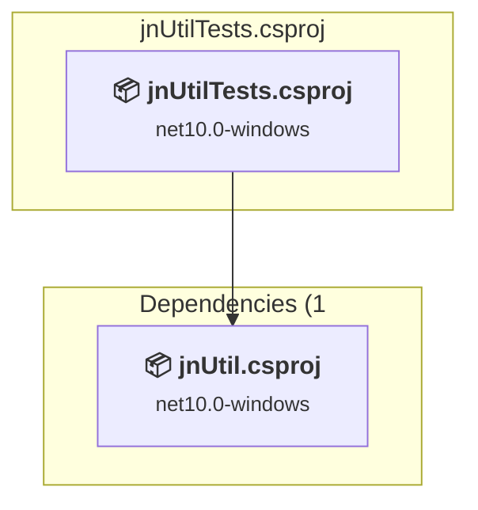

# Projects and dependencies analysis

This document provides a comprehensive overview of the projects and their dependencies in the context of upgrading to .NETCoreApp,Version=v10.0.

## Table of Contents

- [Executive Summary](#executive-Summary)
  - [Highlevel Metrics](#highlevel-metrics)
  - [Projects Compatibility](#projects-compatibility)
  - [Package Compatibility](#package-compatibility)
  - [API Compatibility](#api-compatibility)
  - [Binding Redirect Configuration](#binding-redirect-configuration)
- [Aggregate NuGet packages details](#aggregate-nuget-packages-details)
- [Top API Migration Challenges](#top-api-migration-challenges)
  - [Technologies and Features](#technologies-and-features)
  - [Most Frequent API Issues](#most-frequent-api-issues)
- [Projects Relationship Graph](#projects-relationship-graph)
- [Project Details](#project-details)

  - [jnUtil\jnUtil.csproj](#jnutiljnutilcsproj)
  - [jnUtilTests\jnUtilTests.csproj](#jnutiltestsjnutiltestscsproj)

## Executive Summary

### Highlevel Metrics

| Metric | Count | Status |
| :--- | :---: | :--- |
| Total Projects | 2 | 0 require upgrade |
| Total NuGet Packages | 45 | All compatible |
| Total Code Files | 34 |  |
| Total Code Files with Incidents | 0 |  |
| Total Lines of Code | 6574 |  |
| Total Number of Issues | 0 |  |
| Estimated LOC to modify | 0+ | at least 0,0% of codebase |

### Projects Compatibility

| Project | Target Framework | Difficulty | Package Issues | API Issues | Binding Issues | Est. LOC Impact | Description |
| :--- | :---: | :---: | :---: | :---: | :---: | :---: | :--- |
| [jnUtil\jnUtil.csproj](#jnutiljnutilcsproj) | net10.0-windows | ✅ None | 0 | 0 | 0 |  | ClassLibrary, Sdk Style = True |
| [jnUtilTests\jnUtilTests.csproj](#jnutiltestsjnutiltestscsproj) | net10.0-windows | ✅ None | 0 | 0 | 0 |  | DotNetCoreApp, Sdk Style = True |

### Package Compatibility

| Status | Count | Percentage |
| :--- | :---: | :---: |
| ✅ Compatible | 45 | 100,0% |
| ⚠️ Incompatible | 0 | 0,0% |
| 🔄 Upgrade Recommended | 0 | 0,0% |
| ***Total NuGet Packages*** | ***45*** | ***100%*** |

### API Compatibility

| Category | Count | Impact |
| :--- | :---: | :--- |
| 🔴 Binary Incompatible | 0 | High - Require code changes |
| 🟡 Source Incompatible | 0 | Medium - Needs re-compilation and potential conflicting API error fixing |
| 🔵 Behavioral change | 0 | Low - Behavioral changes that may require testing at runtime |
| ✅ Compatible | 0 |  |
| ***Total APIs Analyzed*** | ***0*** |  |

## Aggregate NuGet packages details

| Package | Current Version | Suggested Version | Projects | Description |
| :--- | :---: | :---: | :--- | :--- |
| Azure.Core | 1.54.0 |  | [jnUtil.csproj](#jnutiljnutilcsproj) [jnUtilTests.csproj](#jnutiltestsjnutiltestscsproj) | ✅Compatible |
| Azure.Monitor.OpenTelemetry.Exporter | 1.8.0 |  | [jnUtil.csproj](#jnutiljnutilcsproj) [jnUtilTests.csproj](#jnutiltestsjnutiltestscsproj) | ✅Compatible |
| coverlet.collector | 10.0.1 |  | [jnUtil.csproj](#jnutiljnutilcsproj) [jnUtilTests.csproj](#jnutiltestsjnutiltestscsproj) | ✅Compatible |
| Microsoft.ApplicationInsights | 3.1.2 |  | [jnUtil.csproj](#jnutiljnutilcsproj) [jnUtilTests.csproj](#jnutiltestsjnutiltestscsproj) | ✅Compatible |
| Microsoft.Bcl.AsyncInterfaces | 10.0.3 |  | [jnUtil.csproj](#jnutiljnutilcsproj) [jnUtilTests.csproj](#jnutiltestsjnutiltestscsproj) | ✅Compatible |
| Microsoft.CodeCoverage | 18.8.1 |  | [jnUtilTests.csproj](#jnutiltestsjnutiltestscsproj) | ✅Compatible |
| Microsoft.Extensions.Configuration | 10.0.0 |  | [jnUtil.csproj](#jnutiljnutilcsproj) [jnUtilTests.csproj](#jnutiltestsjnutiltestscsproj) | ✅Compatible |
| Microsoft.Extensions.Configuration.Abstractions | 10.0.3 |  | [jnUtil.csproj](#jnutiljnutilcsproj) [jnUtilTests.csproj](#jnutiltestsjnutiltestscsproj) | ✅Compatible |
| Microsoft.Extensions.Configuration.Binder | 10.0.0 |  | [jnUtil.csproj](#jnutiljnutilcsproj) [jnUtilTests.csproj](#jnutiltestsjnutiltestscsproj) | ✅Compatible |
| Microsoft.Extensions.DependencyInjection | 10.0.0 |  | [jnUtil.csproj](#jnutiljnutilcsproj) [jnUtilTests.csproj](#jnutiltestsjnutiltestscsproj) | ✅Compatible |
| Microsoft.Extensions.DependencyInjection.Abstractions | 10.0.3 |  | [jnUtil.csproj](#jnutiljnutilcsproj) [jnUtilTests.csproj](#jnutiltestsjnutiltestscsproj) | ✅Compatible |
| Microsoft.Extensions.Diagnostics.Abstractions | 10.0.3 |  | [jnUtil.csproj](#jnutiljnutilcsproj) [jnUtilTests.csproj](#jnutiltestsjnutiltestscsproj) | ✅Compatible |
| Microsoft.Extensions.FileProviders.Abstractions | 10.0.3 |  | [jnUtil.csproj](#jnutiljnutilcsproj) [jnUtilTests.csproj](#jnutiltestsjnutiltestscsproj) | ✅Compatible |
| Microsoft.Extensions.Hosting.Abstractions | 10.0.3 |  | [jnUtil.csproj](#jnutiljnutilcsproj) [jnUtilTests.csproj](#jnutiltestsjnutiltestscsproj) | ✅Compatible |
| Microsoft.Extensions.Logging | 10.0.0 |  | [jnUtil.csproj](#jnutiljnutilcsproj) [jnUtilTests.csproj](#jnutiltestsjnutiltestscsproj) | ✅Compatible |
| Microsoft.Extensions.Logging.Abstractions | 10.0.3 |  | [jnUtil.csproj](#jnutiljnutilcsproj) [jnUtilTests.csproj](#jnutiltestsjnutiltestscsproj) | ✅Compatible |
| Microsoft.Extensions.Logging.Configuration | 10.0.0 |  | [jnUtil.csproj](#jnutiljnutilcsproj) [jnUtilTests.csproj](#jnutiltestsjnutiltestscsproj) | ✅Compatible |
| Microsoft.Extensions.Options | 10.0.3 |  | [jnUtil.csproj](#jnutiljnutilcsproj) [jnUtilTests.csproj](#jnutiltestsjnutiltestscsproj) | ✅Compatible |
| Microsoft.Extensions.Options.ConfigurationExtensions | 10.0.0 |  | [jnUtil.csproj](#jnutiljnutilcsproj) [jnUtilTests.csproj](#jnutiltestsjnutiltestscsproj) | ✅Compatible |
| Microsoft.Extensions.Primitives | 10.0.3 |  | [jnUtil.csproj](#jnutiljnutilcsproj) [jnUtilTests.csproj](#jnutiltestsjnutiltestscsproj) | ✅Compatible |
| Microsoft.Identity.Client | 4.83.1 |  | [jnUtil.csproj](#jnutiljnutilcsproj) [jnUtilTests.csproj](#jnutiltestsjnutiltestscsproj) | ✅Compatible |
| Microsoft.Identity.Client.Extensions.Msal | 4.83.1 |  | [jnUtil.csproj](#jnutiljnutilcsproj) [jnUtilTests.csproj](#jnutiltestsjnutiltestscsproj) | ✅Compatible |
| Microsoft.IdentityModel.Abstractions | 8.14.0 |  | [jnUtil.csproj](#jnutiljnutilcsproj) [jnUtilTests.csproj](#jnutiltestsjnutiltestscsproj) | ✅Compatible |
| Microsoft.NET.Test.Sdk | 18.8.1 |  | [jnUtilTests.csproj](#jnutiltestsjnutiltestscsproj) | ✅Compatible |
| Microsoft.Testing.Extensions.Telemetry | 2.3.3 |  | [jnUtilTests.csproj](#jnutiltestsjnutiltestscsproj) | ✅Compatible |
| Microsoft.Testing.Extensions.TrxReport.Abstractions | 2.3.3 |  | [jnUtilTests.csproj](#jnutiltestsjnutiltestscsproj) | ✅Compatible |
| Microsoft.Testing.Extensions.VSTestBridge | 2.3.3 |  | [jnUtilTests.csproj](#jnutiltestsjnutiltestscsproj) | ✅Compatible |
| Microsoft.Testing.Platform | 2.3.3 |  | [jnUtilTests.csproj](#jnutiltestsjnutiltestscsproj) | ✅Compatible |
| Microsoft.Testing.Platform.MSBuild | 2.3.3 |  | [jnUtilTests.csproj](#jnutiltestsjnutiltestscsproj) | ✅Compatible |
| Microsoft.TestPlatform.ObjectModel | 18.8.1 |  | [jnUtilTests.csproj](#jnutiltestsjnutiltestscsproj) | ✅Compatible |
| Microsoft.TestPlatform.TestHost | 18.8.1 |  | [jnUtilTests.csproj](#jnutiltestsjnutiltestscsproj) | ✅Compatible |
| MSTest.Analyzers | 4.3.3 |  | [jnUtilTests.csproj](#jnutiltestsjnutiltestscsproj) | ✅Compatible |
| MSTest.TestAdapter | 4.3.3 |  | [jnUtilTests.csproj](#jnutiltestsjnutiltestscsproj) | ✅Compatible |
| MSTest.TestFramework | 4.3.3 |  | [jnUtilTests.csproj](#jnutiltestsjnutiltestscsproj) | ✅Compatible |
| OpenTelemetry | 1.15.3 |  | [jnUtil.csproj](#jnutiljnutilcsproj) [jnUtilTests.csproj](#jnutiltestsjnutiltestscsproj) | ✅Compatible |
| OpenTelemetry.Api | 1.15.3 |  | [jnUtil.csproj](#jnutiljnutilcsproj) [jnUtilTests.csproj](#jnutiltestsjnutiltestscsproj) | ✅Compatible |
| OpenTelemetry.Api.ProviderBuilderExtensions | 1.15.3 |  | [jnUtil.csproj](#jnutiljnutilcsproj) [jnUtilTests.csproj](#jnutiltestsjnutiltestscsproj) | ✅Compatible |
| OpenTelemetry.Extensions.Hosting | 1.15.3 |  | [jnUtil.csproj](#jnutiljnutilcsproj) [jnUtilTests.csproj](#jnutiltestsjnutiltestscsproj) | ✅Compatible |
| OpenTelemetry.PersistentStorage.Abstractions | 1.0.3 |  | [jnUtil.csproj](#jnutiljnutilcsproj) [jnUtilTests.csproj](#jnutiltestsjnutiltestscsproj) | ✅Compatible |
| OpenTelemetry.PersistentStorage.FileSystem | 1.0.3 |  | [jnUtil.csproj](#jnutiljnutilcsproj) [jnUtilTests.csproj](#jnutiltestsjnutiltestscsproj) | ✅Compatible |
| System.ClientModel | 1.10.0 |  | [jnUtil.csproj](#jnutiljnutilcsproj) [jnUtilTests.csproj](#jnutiltestsjnutiltestscsproj) | ✅Compatible |
| System.Memory.Data | 10.0.3 |  | [jnUtil.csproj](#jnutiljnutilcsproj) [jnUtilTests.csproj](#jnutiltestsjnutiltestscsproj) | ✅Compatible |
| System.Security.Cryptography.Pkcs | 10.0.10 |  | [jnUtil.csproj](#jnutiljnutilcsproj) [jnUtilTests.csproj](#jnutiltestsjnutiltestscsproj) | ✅Compatible |
| System.Security.Cryptography.ProtectedData | 10.0.10 |  | [jnUtil.csproj](#jnutiljnutilcsproj) [jnUtilTests.csproj](#jnutiltestsjnutiltestscsproj) | ✅Compatible |
| System.Security.Cryptography.Xml | 10.0.10 |  | [jnUtil.csproj](#jnutiljnutilcsproj) [jnUtilTests.csproj](#jnutiltestsjnutiltestscsproj) | ✅Compatible |

## Top API Migration Challenges

### Technologies and Features

| Technology | Issues | Percentage | Migration Path |
| :--- | :---: | :---: | :--- |

### Most Frequent API Issues

| API | Count | Percentage | Category |
| :--- | :---: | :---: | :--- |

## Projects Relationship Graph

Legend:
📦 SDK-style project
⚙️ Classic project

## Project Details

### jnUtil\jnUtil.csproj

#### Project Info

- **Current Target Framework:** net10.0-windows✅
- **SDK-style**: True
- **Project Kind:** ClassLibrary
- **Dependencies**: 0
- **Dependants**: 1
- **Number of Files**: 24
- **Lines of Code**: 5506
- **Estimated LOC to modify**: 0+ (at least 0,0% of the project)

#### Dependency Graph

Legend:
📦 SDK-style project
⚙️ Classic project

### API Compatibility

| Category | Count | Impact |
| :--- | :---: | :--- |
| 🔴 Binary Incompatible | 0 | High - Require code changes |
| 🟡 Source Incompatible | 0 | Medium - Needs re-compilation and potential conflicting API error fixing |
| 🔵 Behavioral change | 0 | Low - Behavioral changes that may require testing at runtime |
| ✅ Compatible | 0 |  |
| ***Total APIs Analyzed*** | ***0*** |  |

### jnUtilTests\jnUtilTests.csproj

#### Project Info

- **Current Target Framework:** net10.0-windows✅
- **SDK-style**: True
- **Project Kind:** DotNetCoreApp
- **Dependencies**: 1
- **Dependants**: 0
- **Number of Files**: 13
- **Lines of Code**: 1068
- **Estimated LOC to modify**: 0+ (at least 0,0% of the project)

#### Dependency Graph

Legend:
📦 SDK-style project
⚙️ Classic project

### API Compatibility

| Category | Count | Impact |
| :--- | :---: | :--- |
| 🔴 Binary Incompatible | 0 | High - Require code changes |
| 🟡 Source Incompatible | 0 | Medium - Needs re-compilation and potential conflicting API error fixing |
| 🔵 Behavioral change | 0 | Low - Behavioral changes that may require testing at runtime |
| ✅ Compatible | 0 |  |
| ***Total APIs Analyzed*** | ***0*** |  |

